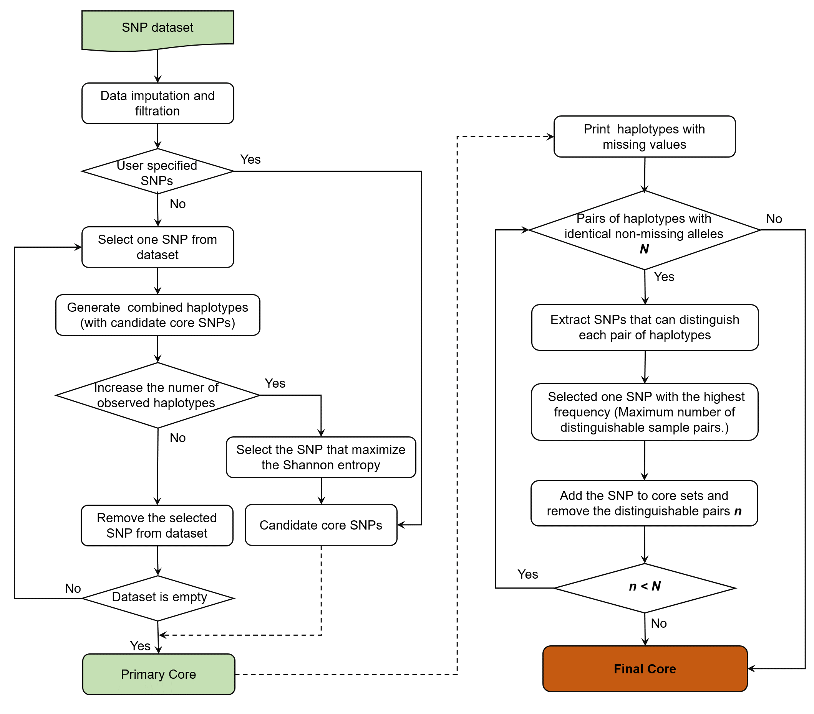

# Minimal coreSNP Selection
An Efficient Pipeline for Selecting Core Markers from Genome-wide SNP Datasets in Crops
 
| Authors | Chunchao Wang      |
| ------- | ------------------ |
| Email   | admy55@gmail.com   |

* Python version >= 3.6
* Required: Numpy
* Required: [PLINK 1.9](https://www.cog-genomics.org/plink/)
* System platform: Linux, Windows, MacOS

 
