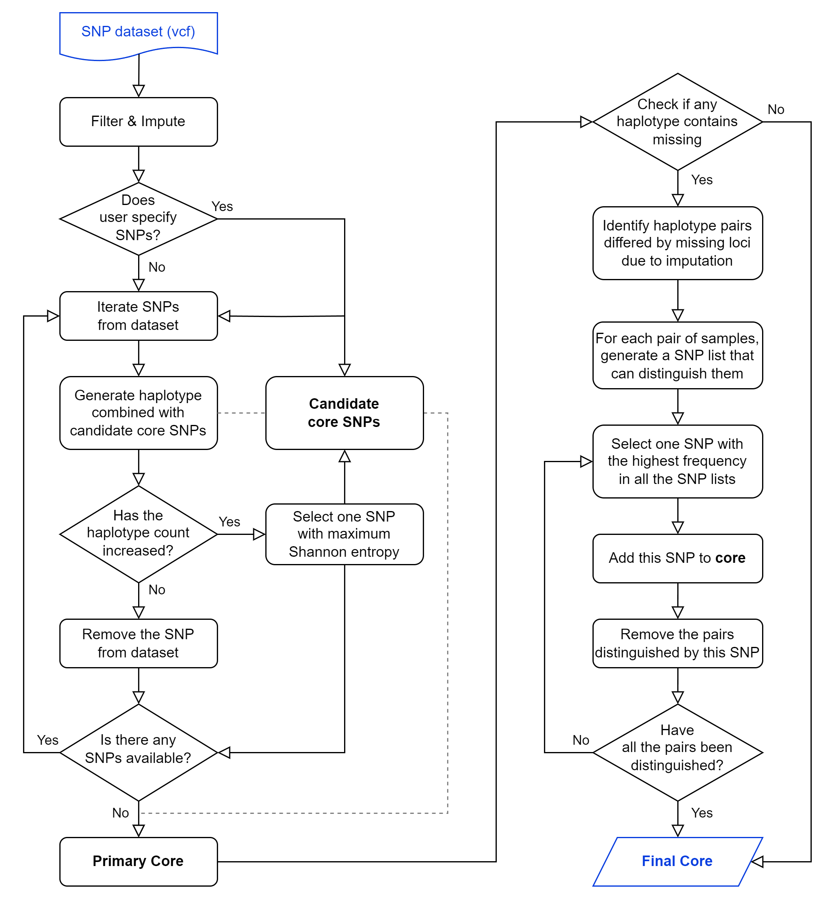

# Minimal Core SNPs Selection
#### An Efficient Pipeline for Selecting Core Markers from Genome-Wide SNP Datasets

We introduce the CoreSNP pipeline, providing Shannon indices to evaluate the discrimination power of maker combinations, with the aim to select a minimal set of core SNPs essential for discrimination of large-scale sequenced samples. 
CoreSNP is designed to use the compressed or uncompressed Variant Call Format (VCF) file as input to produce the core SNP sets results.

## Dependences
* Python >= 3.6
* Numpy
* [PLINK 1.9](https://www.cog-genomics.org/plink/)
* System platform: Linux, Windows, MacOS

## Usage
    python3 CoreSNP.py –-vcf data.vcf

#### Parameters:
    -v/--vcf        <str>    Input VCF file, gzip compressed file is supported.
    -i/--include    <str>    A file contained SNPs that must be included in the core set.
    -e/--exclude    <str>    A file contained SNPs that would never be included in the core set.
    -x/--flexing    <int>    The minimal number of candidate SNPs at each round.
                             (default: 1, range: 1~5)
    -m/--minimal    <int>    The minimal number of differential SNPs for each pairwise samples.
                             (default: 1, range: 1~2)
    -c/--count      <int>    The number of core sets this program generates.
                             (default: 1, range: 1~10)
    -g/--missing    <float>  The threshold of missing call frequency, filter variants with a larger value.
                             (default: 0.2, range: 0~0.5)
    -f/--maf        <float>  The threshold of minor allele frequency, filter variants with a smaller value.
                             (default: 0.0, range: 0~0.5)
    -o/--out        <str>    Directory name of output results.
                             (default: result)
    -l/--log        <str>    Filename of log file.
                             (default: coreSNP.log)
    -M/--more-info  <str>    Print more info to log when running.

 

 

## Publication

## License
GNU General Public License v3.0
